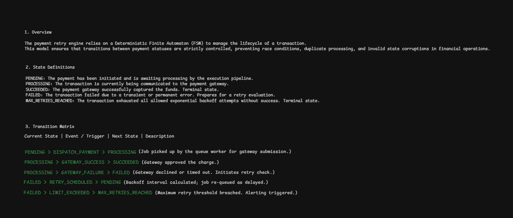

# Payment Retry Engine

O **Payment Retry Engine** é um microsserviço robusto, desenvolvido em NestJS, projetado para o processamento assíncrono de transações financeiras. O foco principal do sistema é garantir **resiliência, idempotência e conformidade rigorosa com normas de segurança (PCI-DSS)** durante cenários de falha na comunicação com gateways de pagamento externos.

---

## State Machine


---

## Funcionalidades Principais

*   **Processamento Assíncrono:** Utilização de BullMQ + Redis para garantir a entrega e retentativa de transações fora do ciclo de requisição HTTP.
*   **Resiliência Financeira:** Implementação de *Backoff Exponencial* com *Jitter* para evitar sobrecarga em gateways.
*   **Segurança de Gateway (Circuit Breaker):** Proteção de chamadas externas com Circuit Breaker (`opossum`) para evitar falhas em cascata.
*   **Idempotência Garantida:** Camadas duplas de proteção (Lock Pessimista no DB + Cache no Redis) para impedir cobranças duplicadas.
*   **Auditoria e DLQ:** Gestão automática de transações falhas (*Dead Letter Queue*) com logs de auditoria detalhados.
*   **Hardening de Segurança:** Validação estrita de ambiente, remoção de dependências de frontend e tratamento global de erros para evitar vazamento de dados.

---

## Pré-requisitos

*   [Node.js](https://nodejs.org/) (v20+)
*   [PostgreSQL](https://www.postgresql.org/)
*   [Redis](https://redis.io/)
*   [Docker](https://www.docker.com/) (Recomendado para infraestrutura local)

---

## Instalação

```bash
# Clone o repositório
git clone <url-do-repositorio>
cd payment-retry-engine

# Instale as dependências
npm install

# Configure o ambiente
cp .env.example .env
# Preencha as variáveis de ambiente necessárias no arquivo .env gerado
```

---

## Como Executar

### Desenvolvimento
```bash
npm run start:dev
```

### Produção
```bash
npm run build
npm run start:prod
```

### Testes
```bash
# Testes unitários e de integração
npm test

# Testes de stress e segurança
npm test test/payments/stress-tests.spec.ts
```

---

## Features de Segurança

*   **Configuração Estrita:** Validação de variáveis de ambiente via `Joi`. O sistema recusa a inicialização se credenciais críticas estiverem ausentes.

*   **Filtro Global de Erros:** O `GlobalExceptionFilter` intercepta todas as exceções e padroniza a resposta em JSON, garantindo a **não exposição** de *stack traces*, *paths* de API ou detalhes sensíveis.

*    **Idempotência Multicamada:**
      * Cache Redis: Filtro rápido para requisições duplas mantendo o single-thread.
      * Lock pessimista: Para impedir que uma mesma transação seja efetuada com a mesma chave de idempotência, mantive o modo pessimista, para manter o controle de concorrência entre chamados e impedir **race conditions**.

*    **Circuit Breaker:** Em caso de gateway fora do ar, a necessidade do **circuit breaker** é indispensável, dessa forma, desenvolvi o circuit breaker a fim de não continuar enviando requisições após compreensão do serviço inacessível.

*    **DLQ:** Transações que forem esgotadas são isoladas no estado final 'EXHAUSTED', dessa maneira, é possível analisar a causa raiz sem bloquear o fluxo principal de pagamentos.

---

## Exemplo de Fluxo

1.  **Criação:** O cliente envia uma requisição de pagamento via `PaymentsController`.
2.  **Enfileiramento:** O `PaymentsService` persiste o pagamento (status PENDING) e enfileira um Job no BullMQ.
3.  **Processamento:** O `PaymentProcessor` consome o Job:
    *   Verifica idempotência no Redis.
    *   Inicia transação atômica (Lock Pessimista).
    *   Executa chamada via `StripeAdapter` (protegida pelo Circuit Breaker).
4.  **Finalização:** Atualiza estado no Banco de Dados e registra sucesso no Redis.
